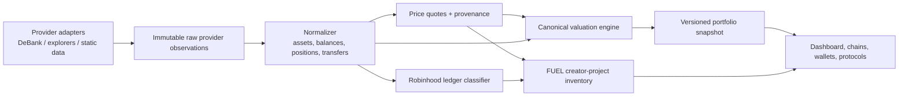

# Canonical portfolio accounting

## Purpose

The dashboard must present one internally consistent answer for every filtered
portfolio value. It must also distinguish ordinary trading performance from the
FUEL creator project without deleting historical wallet data or treating an
estimate as a market quote.

This document is the target contract for the ongoing migration. The production
Pi source was recovered separately from the local Git checkout; reconcile that
source and complete a secret audit before publishing it as a tracked release.

## Non-negotiable invariants

1. One server-built snapshot is the source for headline value, chains, assets,
   protocol positions, wallet settings values, and chips.
2. Every amount has a valuation method, source, confidence, and as-of time.
3. A wallet balance and the same asset inside a protocol position are never
   included twice in the same inclusion scope.
4. Wallet groups are organisational. Accounting scope and refresh policy are
   explicit fields, not inferred from mutable tags.
5. MM ↔ 🐇 Degen is internal to Robinhood trading performance. It does not alter
   funding or withdrawals; its gas remains an expense.
6. FUEL is excluded from trading P&L. Its creator accounting is auditable and
   may be partial, but is never silently shown as an ordinary investment loss.
7. Refresh jobs are user-scoped, persisted, deduplicated, budget-aware, and
   return last-good data while work is in progress or a provider fails.



## Snapshot contract

`GET /dashboard/snapshot` is the canonical read endpoint. A response includes:

```ts
type Value = {
  amountUsd: number | null;
  pricingMethod: "direct" | "pool-implied" | "provider" | "unavailable";
  confidence: "direct" | "estimated" | "unavailable";
  source: string;
  asOf: string;
};

type PortfolioSnapshot = {
  schemaVersion: number;
  snapshotId: string;
  capturedAt: string;
  filters: { walletId: string; chain: string; searchQuery: string };
  totals: { tokenUsd: number; protocolUsd: number; totalUsd: number };
  walletSummaries: Array<{
    walletId: number;
    tokenUsd: number;
    protocolUsd: number;
    totalUsd: number;
    estimatedUsd: number;
    unpricedAssetCount: number;
  }>;
  assets: unknown[];
  protocols: unknown[];
  chains: unknown[];
  dataHealth: { warnings: string[]; totalMatchesChainSummary: boolean };
};
```

Frontend components may format and filter a snapshot. They must not calculate
an alternate total from `amount * price`, persisted provider value, or a second
independent API response.

## Pricing policy

Values follow this order:

1. A direct, fresh indexed quote is `direct`.
2. A provider position value is `provider` only when the position is complete.
3. A FUEL LP with an unpriced FUEL leg and a priced counter-leg uses
   `pool-implied`: `FUEL price = counter-leg USD / FUEL amount`; the full LP is
   twice the priced counter-leg. This is an estimate, not an executable quote.
4. Missing inputs are `unavailable` (`null` value), never a fake `$0`.

The price and valuation metadata must travel with the value into tables, wallet
chips, settings, Robinhood, history, and exports.

## Wallet scopes and refresh policy

Wallets have:

- `group_name`: organisation only (Ledger, browser wallet, agents, etc.).
- `refresh_policy`: `auto`, `manual`, or `audit-only`.
- future explicit accounting memberships: portfolio, trading performance, FUEL
  audit, and historical-only.

Routine refresh uses `auto` wallets only. A selected-wallet job may include
manual/audit-only wallets, enabling a one-time historical review without an
ongoing paid-API cost. Refresh endpoints always authenticate and limit scope by
`user_id`.

## Robinhood and FUEL accounting

Robinhood trading scope is the explicit MM + 🐇 Degen account group. The ledger
classifies deposits, internal transfers, token purchases/sales, external
withdrawals, gas, and reconciliation differences.

FUEL is a separate `CreatorProject` response with two independent sections:

- **FUEL-linked native flow:** only transactions containing a FUEL transfer;
  outbound native value, gas, returned native value, net flow, event links, and
  stated coverage limits.
- **Inventory:** wallet FUEL, LP positions, price source, counter-leg value,
  full LP estimate, and combined recoverable estimate.

FUEL-linked native flow is useful audit evidence, but not comprehensive net
developer cost until deployments, approvals, claims, WETH-funded activity, and
historical USD pricing are classified. The UI must say `Partial on-chain audit`
instead of an indefinite spinner or a definitive P&L claim.

## Persistence and migrations

Use additive, versioned migrations. Preserve raw provider payloads and current
data before backfill. The final model should include:

- canonical assets keyed by chain + normalized contract/mint (not symbol);
- raw provider fetches and normalized balance/position observations;
- price quotes with source/freshness/confidence;
- immutable portfolio snapshots and components;
- transaction legs, transfer links, and classification overrides;
- wallet groups/memberships and refresh jobs.

`sequelize.sync()` remains temporary compatibility behavior. Remove it only
after models and versioned migrations are fully parity-checked on a disposable
database.

## Release and test gates

Before a release:

1. Run backend unit tests without provider calls and frontend type-check/build.
2. Assert snapshot total equals its chain/wallet component sums for an
   unfiltered scope.
3. Assert a pool-implied FUEL LP includes both legs once everywhere.
4. Assert same-tag wallets remain distinct by immutable wallet ID.
5. Assert MM ↔ 🐇 Degen does not alter external funding/withdrawals.
6. Assert FUEL remains excluded from ordinary token P&L.
7. Assert audit-only wallets are absent from routine refresh and available in a
   selected one-time job.
8. Review deployment diff and confirm no `.env`, cache, database dump, private
   key, or provider credential is staged or pushed.
