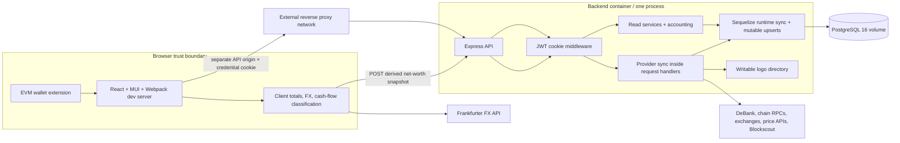
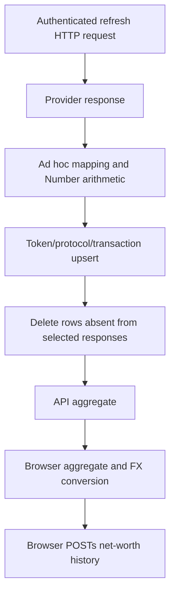
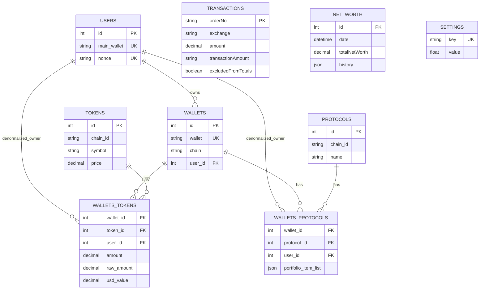
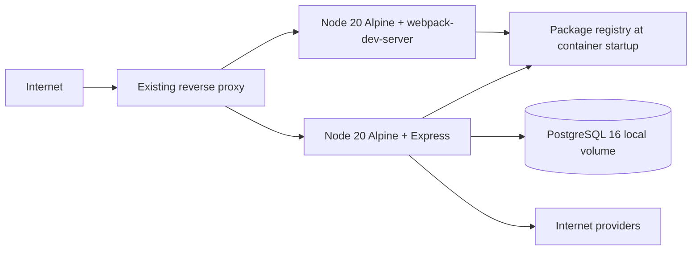

# Current architecture and data flow

## Repository and runtime inventory

The checked-in application is three independent JavaScript package roots rather than a workspace: root orchestration, `frontend`, and `backend`. The frontend is React/TypeScript compiled by custom Webpack. The backend is JavaScript/ES modules on Express/Sequelize/PostgreSQL. Provider synchronization and financial calculations share the API process.

## Current authoritative data flow

There is no immutable ingestion layer. The nominal data flow is:

Raw provider payloads, request ranges, page cursors, adapter versions, costs, and reconciliation outcomes are not persisted. Provider corrections overwrite prior transaction/balance values. A failure after some writes leaves those writes committed.

## Main API surface

All routes below are cookie-authenticated except `/api/auth/*`.

| Area | Routes | Current behavior |
|---|---|---|
| Auth | `GET /auth/check`, `GET /auth/message`, `POST /auth/login`, `POST /auth/logout` | Bespoke wallet signature and stateless JWT cookie |
| Wallets | `GET/POST /wallets`, `PUT/DELETE /wallets/:id` | Mostly user-scoped CRUD; delete cascades current rows |
| Sync | `POST /wallets/refetch*` | Executes provider work synchronously in the API process |
| Provider usage | `GET /debank/units` | Returns account-wide DeBank usage to any authenticated user |
| Holdings | `GET /tokens`, `GET /chains`, `GET /protocols-table` | Aggregates mutable current rows using floating arithmetic |
| Net worth | `GET/POST /net-worth` | Global history; POST trusts browser total/history JSON |
| Activity import | Binance/Kraken/Gnosis `GET`, Rubic `POST` | Provider calls and database writes; several GETs have side effects |
| Activity | `GET /transactions`, `PATCH /transactions/:id/exclusion` | Global rows and mutable unaudited exclusion |
| Performance | `GET /robinhood/performance` | Live Blockscout fetch, in-memory cache, heuristic calculation |
| Settings | `GET/POST /settings/hidesmallbalances` | Global numeric setting |

## Current persistence model

`TRANSACTIONS`, `NET_WORTH`, and `SETTINGS` are disconnected because they have no owner. Chain metadata is split between `evm_chains` and `non_evm_chains`. There are no raw observations, prices, canonical events, lots, sync runs, checkpoints, adjustments, audit log, or durable sessions.

## Provider inventory and current behavior

| Provider/source | Data | Invocation | Pagination/checkpoint | Cache/retry | Key concerns |
|---|---|---|---|---|---|
| DeBank Pro | EVM balances/protocols, HYPE metadata, chain list, units | Wallet refresh/API | Provider full-list endpoints; no recorded cursor | In-memory dedup/TTL; forced refresh bypasses key TTLs; no retry/timeout | Paid calls un-attributed; empty response can drive deletion |
| Solana public RPC | Native/SPL/Token-2022 balances | Wallet refresh | Point-in-time balance calls | SDK defaults | No slot commitment recorded; `Number` conversion |
| Jupiter | Solana metadata/current price | Wallet refresh | Full verified list, then per-mint lookup | Failure returns null | Unknown metadata retained only indirectly; identity discarded |
| Cosmos REST endpoints | Native/staking balances | Wallet refresh | Point-in-time calls | Endpoint fallback, 15 s timeout | IBC/factory denoms explicitly ignored; optional ownership filter |
| Sui/Aptos public SDK endpoints | Selected balances/stake | Wallet refresh | Point-in-time calls | No common retry/checkpoint | Sui tracks only configured tokens; Aptos excludes delegated stake in main path |
| Hyperliquid Info | Spot balances/market context | EVM/all refresh | Point-in-time calls | 20 s timeout | USD stable value assumed; stale-row deletion |
| CoinGecko | Current crypto prices/FX proxy | Many sync paths | Simple price requests | Errors become null/zero; little batching | No stored provenance/history; per-token calls |
| Binance | Fiat payments/orders | Authenticated GET | No explicit page loop | No timeout/retry | Incomplete range possible; global credentials/table |
| Kraken | Ledgers and XMR/FX OHLC | Authenticated GET | Offset loop, no durable checkpoint | No timeout/retry; XMR adds two calls per row | Expensive repeated history; current five-year window |
| Gnosis Pay | Card transactions | Browser-supplied bearer token | One results page | No retry/checkpoint | Secret traverses browser; current FX; global rows |
| Rubic | Cross-chain activity | Authenticated POST | Page 1, 100 records | No retry/checkpoint | Missing values coerced/defaulted; caller supplies addresses |
| Blockscout | Robinhood account/history | Performance GET | Up to 500 pages from start | Two short retries on 429/5xx; 5 min memory cache | No persisted source/checkpoint; heuristic classification |
| Frankfurter | Browser USD/EUR to CHF | Page load/component | Current rate only | None | Financial conversion outside authoritative backend |
| Remote logo hosts | Images | During provider sync | N/A | Existing-file cache | Server-side fetch of provider URLs; mutable filesystem |

## Current calculation paths

### Net worth

`sum(token amount × mutable current token price) + sum(protocol provider USD values)` is calculated independently by backend aggregation and browser components. The browser then writes the result as history. There is no chosen price set, observation cut, cash-flow link, or account owner.

### Transaction/cash flow

Provider strings are mapped in the frontend into deposit/withdrawal categories. Amounts and signs are normalized with absolute values. Current EUR/CHF can substitute for missing historical conversion. Gnosis spending and Rubic XMR are combined into “value taken out,” then deposits are subtracted for “net cash returned.” These rules are not shared with the backend.

### Robinhood performance

Blockscout transfers are heuristically grouped by transaction hash. ETH inflows, bridge internals, token transfers, contract/non-contract destinations, and method names drive classifications. A function called FIFO tracks reinvested sale proceeds, while token cost basis uses average cost. Current ETH/USD and token prices value historical and current results. Confirmed closed contracts are source constants.

## Current deployment shape

The DB-only `app` network is internal, which is positive. However the API and frontend are separate origins, source is bind-mounted, dependencies install at startup, only PostgreSQL has a health check, and there is no worker, static server, backup, resource limit, read-only filesystem, or artifact-based rollback.

## Frontend composition audit

Static source analysis shows the loaded application primarily uses React, MUI/Emotion, Recharts, Axios, Ethers, and `date-fns`. The manifest also installs a much broader set of Cosmos, Solana, Sui, Aptos, Web3, server, and browser-polyfill dependencies that the current `frontend/src` does not import. Webpack's vendor groups separate React, MUI, charts, and all remaining packages, but allow a 2 MB entry warning threshold. Because dependencies were absent and the build script has a `dist`/`build` mismatch, no trustworthy byte-level bundle baseline was produced. Phase 1 must produce a reproducible stats artifact and enforce route/initial budgets.

## Git/history observations

- Audit baseline: `6f7eadb` (`Improve portfolio sync and accounting`).
- `31e17d9` added portfolio performance, then `2a20e90` removed it as inaccurate.
- `50d78ce` added cash-flow-adjusted net-worth history, then `289909a` reverted it.
- `a7803c9` addressed repeated protocol positions.

This history is evidence that formulas and aggregation require characterization and versioning before migration; it is not evidence that the current outputs are correct.
