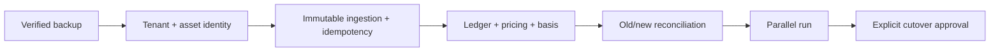

# Risk register

Scales: likelihood and impact are `Low`, `Medium`, `High`, or `Critical`. Residual risk assumes the listed response is implemented and verified.

| ID | Risk | Likelihood | Impact | Leading indicator | Response / control | Owner | Residual | Gate |
|---|---|---:|---:|---|---|---|---:|---|
| R-01 | Legacy data is altered or lost during migration | High | Critical | Import writes to legacy schema; backup not restored in test | Read-only legacy role; new schema; encrypted pre-migration backup; checksum manifest; restore drill; no drops | Owner + data | Low | Before Phase 2 |
| R-02 | Browser or partial provider state creates false history | High | Critical | Snapshot has no completed projection/run | Worker-only snapshot creation; completeness/reconciliation gates; immutable inputs | Data | Low | Before v2 snapshots |
| R-03 | Cross-tenant data exposure/mutation | High | Critical | Query lacks account predicate/RLS context | Account ownership on every table; RLS; repository context; adversarial isolation tests | Security | Low | Before any second account |
| R-04 | Symbol collision maps balances/prices to the wrong asset | High | Critical | Same symbol with multiple references | Canonical namespace/reference identity; provider mapping; reviewed asset groups; collision fixtures | Domain + data | Low | Before asset import |
| R-05 | Provider partial success erases prior good projection | High | Critical | Missing count drops during failed/partial run | Append observations; run-scoped staging; atomic promotion; no delete-on-fetch; preservation tests | Data | Low | Before adapters write |
| R-06 | Legacy formula differences remain unexplained | High | High | Wallet/stat delta above tolerance with no reason code | Old-vs-new report by date/wallet/metric; difference taxonomy; owner sign-off | Accounting | Medium | Before parallel run exit |
| R-07 | Missing cost basis is reported as profit | High | High | Disposal consumes zero/negative-basis inventory | Basis completeness propagation; P&L null when incomplete; needs-review queue | Accounting | Low | Before Performance release |
| R-08 | Internal transfers/bridges double-count funding | High | High | Paired legs appear as contribution/distribution | Transfer matching; bridge event model; reconciliation/property tests; manual review | Accounting | Medium | Before cash-flow metrics |
| R-09 | Historical/current price manipulation or bad mapping distorts value | Medium | Critical | Provider outlier/divergence; low-confidence price selected | Multi-source policy where justified; confidence/outlier rules; provenance; alert/review; no silent fallback | Data + owner | Medium | Before valuation release |
| R-10 | SIWE replay/session theft authorizes mutations | Medium | Critical | Reused nonce/session after logout | Strict SIWE, atomic nonce consume, opaque server sessions, rotation/revocation, rate limits | Security | Low | Before public access |
| R-11 | CSRF/XSS causes wallet, adjustment, or sync actions | Medium | High | Cross-site mutation; CSP report | Same-origin cookies, CSRF/Origin/Fetch-Metadata, CSP/security headers, output encoding | Security | Low | Before new API mutations |
| R-12 | Provider credentials leak through UI/log/backup | Medium | Critical | Secret-shaped field in response/log/raw payload | Server-only encrypted connections; redaction tests; strip headers; backup encryption; rotation procedure | Security + ops | Low | Before credential import |
| R-13 | Provider/RPC abuse or retry storms exhaust quota | High | High | Credit burn, 429s, queue backlog | Per-provider token bucket, concurrency, Retry-After, budgets/quotas, circuit breaker, alerting | Providers + ops | Medium | Before scheduled sync |
| R-14 | DeBank cost reduction harms correctness | Medium | High | Freshness rises or assets disappear after optimization | Endpoint-specific freshness, explicit source quality, inactive policy approval, reconciliation sampling | Providers | Low | Before optimization rollout |
| R-15 | Immutable raw payloads grow beyond Pi capacity | High | High | DB/archive growth slope exceeds budget | Compression, partitioning, archive policy, capacity alert, content dedup, retention decision | Ops + owner | Medium | Before long-running ingestion |
| R-16 | Pi CPU/RAM/storage cannot run API, worker, tests, and DB safely | Medium | High | OOM/restarts/queue lag/IO pressure | Measured resource budget; worker concurrency 1 default; image slimming; off-device heavy jobs; alerts | Ops | Medium | Before Pi deploy |
| R-17 | Backup exists but cannot restore | Medium | Critical | No recent restore evidence | Automated integrity checks; quarterly isolated restore; documented RPO/RTO; cutover rehearsal | Ops + owner | Low | Before cutover |
| R-18 | Migration locks or long queries disrupt legacy dashboard | Medium | High | DB locks, latency, disk spike | Separate schema; small forward migrations; concurrent indexes; replica/snapshot tests; maintenance window | Database | Low | Each production migration |
| R-19 | Dual systems double paid API use or diverge | High | Medium | Cost doubles; timestamps incomparable | Share accepted observations where safe; coordinate schedules; tag runs by system; budget cap; same valuation cut | Providers + data | Medium | Parallel run |
| R-20 | Queue duplicate delivery creates duplicate events | High | High | Same source event appears more than once | At-least-once design with observation/event idempotency keys and uniqueness constraints; replay tests | Worker + data | Low | Before worker release |
| R-21 | Manual rule applies too broadly | Medium | High | Large event set reclassified after rule creation | Preview/diff, explicit scope, versioned rule, four-eyes approval for broad rules, reversible application | Accounting + UX | Low | Before rules release |
| R-22 | SaaS billing/provider budgets cross account boundaries | Medium | High | One account consumes global credits | Connection/account metering, hard limits, admission control, per-account reports | Product + ops | Low | Before SaaS |
| R-23 | Dependency compromise or ARM64 incompatibility blocks deploy | Medium | High | Advisory/build failure, unavailable image | One lock, SBOM, approved audit, pinned digests, ARM64 CI/build smoke test, minimal dependencies | Engineering + ops | Medium | Phase 1 and releases |
| R-24 | Observability leaks wallet/activity/provider data | Medium | High | Raw payload/secret in log/export | Structured allowlist logging, redaction, access controls, short retention, privacy review | Security + ops | Low | Before centralized logs |
| R-25 | Accessibility/responsive regressions block daily use | Medium | Medium | Keyboard/mobile Playwright failures | Semantic design system, WCAG AA checks, real-device responsive tests, no horizontal main-page overflow | UX + web | Low | Phase 6 release |
| R-26 | Owner definitions change after import/projection | Medium | High | Repeated rule/model rewrites | Resolve blocking decisions; version formulas/rules; rebuild from immutable observations | Owner + accounting | Medium | Before Phase 4 |
| R-27 | Future deletion/privacy requirements conflict with provenance | Medium | High | Account deletion request while raw data retained | Separate ownership/identity, encrypted per-account keys, documented legal/retention policy, cryptographic erasure design | Owner + legal | Medium | Before SaaS |
| R-28 | Time zone/day-boundary differences change cash flow and snapshots | High | Medium | Same event lands on different reporting day | UTC storage, explicit source timestamp, account reporting zone, versioned day-close policy, DST fixtures | Accounting | Low | Before history rebuild |

## Highest-risk sequence

Skipping an earlier control makes every later result less trustworthy. In particular, UI redesign, worker scheduling, or migration imports must not precede backup, identity, and source-provenance controls.
