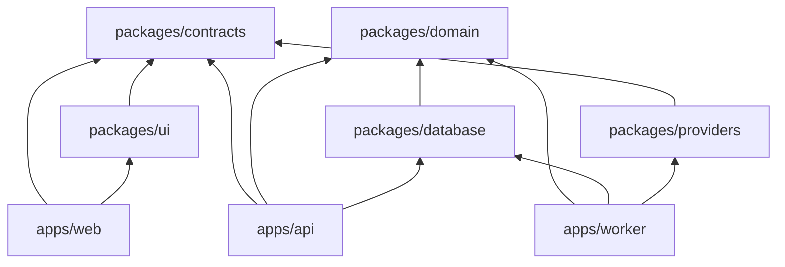
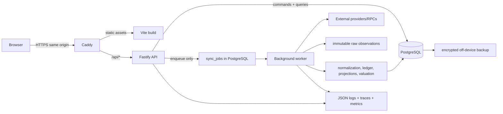
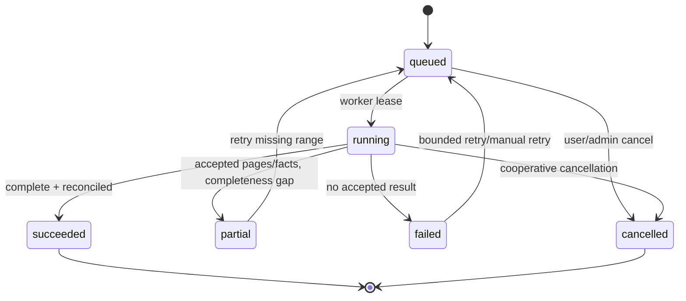

# Target architecture and immutable pipeline

## Architectural decisions

The replacement is a TypeScript modular monolith with three runtime processes and one repository. It keeps domain logic independent of Fastify, React, provider SDKs, and PostgreSQL so that calculations can be replayed and tested without network access.

Recommended baseline:

- One `pnpm` workspace and one lockfile.
- React + Vite web app with TanStack Query and TanStack Router.
- Fastify API with TypeBox request/response schemas and generated OpenAPI client types.
- Separate TypeScript worker process.
- PostgreSQL with Drizzle schema types and checked-in generated/reviewed SQL migrations.
- PostgreSQL-backed jobs implemented with leases and `FOR UPDATE SKIP LOCKED` initially; no additional broker on the Pi.
- Vitest, fast-check, Testcontainers, and Playwright.
- Structured JSON logging and OpenTelemetry-compatible traces/metrics.
- Caddy as same-origin TLS/static server and `/api` reverse proxy on the Pi.

Using Fastify TypeBox schemas plus generated OpenAPI types satisfies the typed-router requirement while retaining a conventional HTTP API suitable for future non-TypeScript clients. Any change to these choices must be recorded in an architecture decision before implementation.

## Repository layout

```text
apps/
  web/                 React/Vite routes and view-only formatting
  api/                 Fastify commands, queries, auth, health
  worker/              durable jobs, adapters, projections, schedules

packages/
  domain/              assets, events, ledger, lots, valuation, reconciliation
  database/            Drizzle schema, repositories, SQL migrations, RLS helpers
  providers/           adapter contract and provider-specific adapters
  contracts/           TypeBox API/provider schemas and generated clients
  ui/                  tokens, accessible components, tables, explanation drawer
  config/              validated runtime configuration, no secret values

tests/
  fixtures/            sanitized immutable provider/domain fixtures
  contracts/           provider contract cases
  integration/         PostgreSQL, RLS, queue, migration, projection tests
  e2e/                 Playwright flows

deploy/
  pi/                   Compose, Caddyfile, backup/restore wrappers and runbooks
  saas/                 future deployment descriptors, not active in Phase 1
```

Dependency direction is one-way:



`domain` must not import React, Fastify, Drizzle, provider SDKs, Node HTTP clients, or environment variables. `providers` may translate external payloads into contract types but may not write projections directly.

## Runtime architecture



### Web responsibility

- Authenticate, request account-scoped read models, submit validated commands, and display explicit freshness/completeness.
- Format decimal strings without changing authoritative values.
- Never fetch financial prices/RPC data directly.
- Never create snapshots, classify silently, or calculate official P&L/net worth.

### API responsibility

- Validate every request and serialized response.
- Establish user/session/account context and database RLS context.
- Serve portfolio read models and calculation explanations.
- Record auditable commands such as enqueue sync, create adjustment, preview/apply rule, or revoke connection.
- Never perform provider synchronization inside a request.

### Worker responsibility

- Lease durable jobs, apply concurrency/budget/rate policy, call adapters, and record attempts.
- Persist immutable observations before normalization.
- Normalize and project only versioned, validated inputs.
- Advance checkpoints and promote current projections transactionally.
- Rebuild read models/snapshots and emit reconciliation/freshness outcomes.

## Immutable ingestion pipeline

```mermaid
flowchart LR
  Request["Provider request descriptor"] --> Run["sync run + attempt"]
  Run --> Fetch["adapter fetch/page"]
  Fetch --> Raw["content-addressed raw observation"]
  Raw --> Validate["schema + completeness validation"]
  Validate --> Normalize["versioned normalized source facts"]
  Normalize --> Events["canonical financial events"]
  Events --> Ledger["balanced ledger postings + lots"]
  Ledger --> Projection["balances + positions"]
  Projection --> Reconcile["source-vs-projection checks"]
  Reconcile --> Prices["timestamped price resolution"]
  Prices --> Snapshot["versioned portfolio read model"]
  Snapshot --> API["typed API"]
  API --> UI["explainable UI"]
```



### Stage contracts

1. **Request descriptor:** account, connection, wallet, chain, capability, adapter/version, requested range/cursor, freshness reason, estimated credits, idempotency key. It contains no secret value.
2. **Raw observation:** exact sanitized payload bytes/JSON, HTTP/provider metadata, received/observed/effective times, content hash, page/cursor, schema version, and request fingerprint. Authentication headers and secret query fields are removed before storage.
3. **Normalization:** deterministic pure transformation from observation plus adapter/rule version. Every normalized row references its observation and stable source key.
4. **Canonical events:** transfer/trade/reward/fee/etc. with linked legs and an explicit classification state. Provider corrections create new versions; they do not overwrite the old evidence.
5. **Ledger/projections:** exact postings and lots, then current balance/position projections keyed by projection version.
6. **Valuation:** selected immutable price IDs for asset/currency/time buckets, with confidence/method and no implicit zero.
7. **Read model:** account/reporting-policy/version scoped, precomputed for API reads. Each number exposes a calculation ID.

## Sync lifecycle



Each run records the required account/wallet/chain/provider/version/times/range/status/counts/cost/rate-limit/errors/checkpoints/freshness/reconciliation fields. Attempts are child records so transient failures are not flattened.

### Promotion rules

- Raw observations are inserted independently and are never rolled back because later normalization fails.
- Normalized facts/events are idempotent by `(account, provider connection, source namespace, source key, normalization version)` plus content/version lineage.
- Current projections are built into a new `projection_version` and promoted by a short database transaction.
- `failed` runs never promote.
- `partial` runs may promote only capabilities/ranges explicitly known complete; otherwise prior current projection remains active and is marked stale/partial.
- An empty balance response is not proof of a zero balance unless adapter completeness checks and reconciliation pass.
- Checkpoints advance only with the committed accepted observation set.

## Durable PostgreSQL job queue

Initial queue semantics are at-least-once:

- `sync_jobs` stores account, capability, request JSON, priority, schedule time, attempts, lease owner/expiry, cancellation time, and idempotency key.
- A partial unique index prevents concurrent active jobs for the same account/connection/wallet/capability/range.
- Workers claim with `SELECT … FOR UPDATE SKIP LOCKED`, commit the lease, heartbeat it, and requeue expired leases.
- Provider/account advisory locks and per-provider token buckets limit concurrency.
- Duplicate delivery is expected and neutralized by observation/event uniqueness.
- A transactional outbox records read-model invalidation and telemetry events without requiring Kafka/RabbitMQ.

Move to an external broker only if measured queue latency, database load, or horizontal scale requires it.

## Read model and explainability contract

Every displayed metric carries or links to:

```ts
type CalculationExplanation = {
  calculationId: string;
  metric: string;
  formulaVersion: string;
  formula: string;
  reportingCurrency: string;
  asOf: string;
  completeness: "complete" | "partial" | "unknown";
  confidence: "high" | "medium" | "low" | "unknown";
  includedSourceIds: string[];
  excludedRecordIds: string[];
  priceIds: string[];
  adjustmentIds: string[];
  warnings: Array<{ code: string; message: string }>;
};
```

List endpoints return summary explanation IDs and warnings; detail endpoints resolve sources and formulas on demand to keep payloads compact.

## Observability

Standard correlation fields: `request_id`, `trace_id`, `account_id` (opaque), `job_id`, `sync_run_id`, `provider`, `adapter_version`, `wallet_id` (opaque), `capability`, and `result_status`. Wallet addresses, raw payloads, signatures, API keys, session tokens, and provider authorization headers are excluded or redacted.

Core metrics:

- Queue depth/age, leases expired, attempts, run duration/status.
- Provider calls, credits, bytes, 429/5xx, Retry-After, latency.
- Observation/fact/event counts and rejects.
- Projection age, stale accounts, unpriced assets, unknown events.
- Reconciliation difference/status.
- API latency/errors and database pool/lock/size.
- Backup age/result and restore-test age.

## Architecture acceptance criteria

- Three independently startable runtimes exist and only the worker imports provider adapters.
- Web/API compile from shared contracts; all routes validate requests and responses.
- A recorded fixture can replay raw → normalized → events → ledger → projection → valuation without network access.
- Duplicate jobs/observations do not duplicate financial events.
- A failed/partial run cannot erase the active good projection.
- Every authoritative table row is account-owned or immutable global reference data.
- No authoritative decimal passes through JavaScript floating arithmetic.
- Every portfolio metric resolves a calculation explanation.
