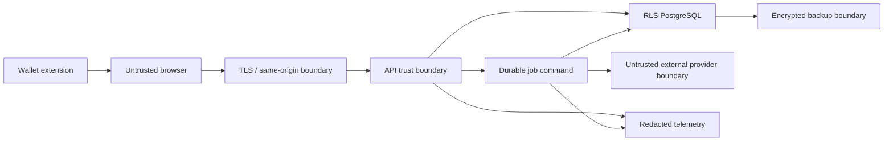

# Authentication and threat model

## Security target

Use OWASP ASVS Level 2 as the minimum verification baseline, extended with portfolio-specific controls in this document. Pin the ASVS release and verification checklist at Phase 1 implementation time. The private Pi is not a reason to omit tenant, session, CSRF, secret, backup, or audit controls.

## Trust boundaries and assets

Protected assets: session authority, account membership, provider credentials, wallet/address activity, financial observations/events/adjustments, calculation integrity, audit trail, provider quotas, database/backup encryption keys, and operational metadata.

## SIWE login protocol

1. Browser requests a challenge for a normalized EVM address and intended account/login operation.
2. Server creates a cryptographically random nonce and stores a hashed challenge with domain, URI, chain ID, issued-at, expiration, request ID, address, and intended action.
3. Browser constructs a strict EIP-4361 SIWE message using server fields and the current origin; no free-form client substitutions.
4. Wallet signs after network/account confirmation.
5. Server parses the SIWE message, requires exact domain/URI/nonce/chain/address/time match, verifies signature, and atomically marks the challenge consumed.
6. Server verifies enrollment/invite policy and account membership before creating a session.
7. Server sets an opaque random cookie whose hash maps to the session row. The cookie is `Secure`, `HttpOnly`, `SameSite=Lax`, host-only, path `/`, and short-lived with bounded rotation.
8. Sensitive actions may require recent reauthentication depending on owner policy.

Authentication wallet identities and tracked portfolio wallets are separate concepts. Signing with an address does not automatically grant access to every account that tracks that public address.

## Session lifecycle

- Short idle and absolute expiry, owner-approved.
- Rotate session token after login, privilege/account switch, reauthentication, and periodically; invalidate prior hash.
- Revoke on logout, membership removal, credential reset, suspected theft, or owner action.
- List/revoke active sessions in settings.
- Store no raw session token, signature, or SIWE message in logs.
- Bind high-risk mutations to CSRF and recent membership check; optionally record coarse device/IP hashes for anomaly review without making them brittle authentication factors.
- Server-side session cache may accelerate reads but PostgreSQL remains revocation authority.

## Authorization model

Roles: `owner`, `admin`, `editor`, `viewer`.

| Capability | Owner | Admin | Editor | Viewer |
|---|---:|---:|---:|---:|
| View portfolio/data health/source explanations | Yes | Yes | Yes | Yes |
| Enqueue normal sync | Yes | Yes | Yes | No by default |
| Create one-time classification adjustment | Yes | Yes | Yes | No |
| Create future/broad classification rule | Yes | Yes | Preview only by default | No |
| Add/rotate provider connection | Yes | Yes | No | No |
| Manage members/roles, delete/export account | Yes | No by default | No | No |
| Approve cutover/destructive retention action | Owner/operator outside app | No | No | No |

Authorization is checked in API command services and re-enforced by RLS. Repositories require an account context. Background jobs include account ownership and the worker sets RLS context from the leased, signed/validated job row.

## Cookie/CSRF/CORS

- Serve web and API from one origin (`/api`) so cross-site cookie mode is unnecessary.
- Mutations require a CSRF token tied to session plus strict `Origin`/`Sec-Fetch-Site` validation. JSON content type alone is not a CSRF defense.
- CORS is disabled in normal same-origin production. If a future client requires it, use an exact allowlist per environment and never reflect arbitrary origins.
- WebSocket/SSE connections validate Origin and session/account scope if introduced.
- Logout/revoke are protected mutations.

## Security headers

At the proxy, with API reinforcement as appropriate:

- Strict-Transport-Security after TLS/domain validation.
- Content-Security-Policy with `default-src 'self'`; narrow script/style/connect/img directives; no unsafe script execution; provider images served through a controlled local pipeline.
- `frame-ancestors 'none'`, `base-uri 'none'`, `object-src 'none'`, `form-action 'self'`.
- `X-Content-Type-Options: nosniff`, strict Referrer-Policy, Permissions-Policy, and cross-origin isolation policies where compatible.
- Cache controls: private/no-store on auth/source-sensitive endpoints; immutable caching for hashed static assets.

## Secret management

- `packages/config` classifies every setting as public, sensitive, or secret and validates at startup.
- Production has no credential defaults. API/worker fail before listening/claiming when required keys are absent or weak.
- Provider secrets live only in `provider_connections` as envelope-encrypted blobs: a random data-encryption key per connection, encrypted by a versioned master key outside the database.
- API can create/rotate/test a credential but never read it back. Responses show last four/metadata only if safe.
- Worker decrypts only for the scoped adapter call and clears references promptly.
- Use provider read-only, IP-scoped, least-privilege keys wherever supported; never enable withdrawals/trading.
- Logs/telemetry/errors/raw observations strip authorization headers, signed URLs/query signatures, cookies, SIWE signatures, and payload secret fields.
- Backups are encrypted independently; master keys are not stored in the same backup.

## Secret rotation checklist

1. Identify credential ID, provider scope, affected accounts/jobs, and owner authorization.
2. Pause new jobs for that connection; do not cancel unrelated providers.
3. Create least-privilege replacement at provider and verify out-of-band account/permission scope.
4. Store replacement under a new encryption-key/credential version and health-check without logging it.
5. Atomically activate new version; enqueue a small bounded verification sync.
6. Confirm data/reconciliation/provider usage.
7. Revoke old credential at provider, then mark old encrypted version retired (retain safe metadata/audit record, not reusable secret).
8. Review logs/alerts for misuse; revoke sessions or rotate master key if exposure is suspected.
9. Record actor, reason, times, verification run, and provider revocation confirmation in audit log.

## Threat model

| Threat | Entry/trust boundary | Impact | Required controls | Verification |
|---|---|---|---|---|
| Wallet impersonation | Browser → auth | Account takeover | Strict SIWE fields, signature/address/chain validation, enrollment policy, recent-auth for high risk | Unit + browser negative cases |
| Signature replay | Auth | Account takeover | Random expiring nonce, atomic consume, one-time action/domain/URI binding, login rate limit | Concurrent replay integration test |
| Cross-tenant access | API/worker → DB | Full confidentiality/integrity breach | Membership service, required account context, forced RLS, non-bypass roles, opaque IDs | Two-tenant route/repository/job tests |
| CSRF | Web → API | Unauthorized wallet/rule/sync/logout mutations | Same-origin Lax cookie, CSRF token, Origin/Fetch-Metadata, no state-changing GET | Playwright cross-origin test |
| XSS | Provider/user metadata → web | Session actions/data theft | React escaping, schema validation, CSP, no raw HTML, controlled logos, safe links | CSP + payload/browser tests |
| SSRF | Provider logo/config/URL fetch | Internal network/metadata access | Fixed adapter hosts, URL allowlist, DNS/IP/redirect validation, egress controls, image proxy/re-encode | Unit/integration malicious URL cases |
| Poisoned provider data | Provider → worker | False balance/price/event, XSS/resource exhaustion | Strict schemas, size limits, canonical identity, price confidence/outliers, reconciliation, immutable evidence | Contract fuzz/malformed/outlier tests |
| Price manipulation | Price providers/resolver | False valuation/P&L | Approved mappings/sources, timestamp bounds, confidence/divergence rules, manual review/provenance | Resolver fixtures/property tests |
| RPC/provider abuse | API/queue/worker | Cost exhaustion/ban/unavailability | Role checks, rate/concurrency/budget/quotas, unique jobs, Retry-After/circuit breaker | Load/duplicate-job tests and alerts |
| Session theft | Browser/log/backup | Account takeover | HttpOnly/Secure, CSP, token hashes, rotation/revocation, no logs, short expiry | Session lifecycle tests |
| Database injection | API/provider data → DB | Data breach/corruption | Typed schemas, parameterized queries, no dynamic SQL identifiers, least privilege | Static scan + injection tests |
| Malicious adjustment/rule | Authorized editor | Systematic accounting distortion | Preview/diff, narrow scope, role/reauth, audit, reversible versions, broad-rule approval | Permission + impact-preview tests |
| Job forgery/cross-account lease | API/DB → worker | Cross-tenant fetch/write | DB-generated job ownership, RLS, worker role, signed/validated request schema, no arbitrary URLs | Worker isolation tests |
| Backup theft | Off-device storage | Historical financial/credential exposure | Strong encryption, separate key custody, access/retention, restore host controls | Recovery exercise/security review |
| Log/trace leakage | API/worker → telemetry | Wallet/secret/privacy exposure | Allowlist structured fields, central redactor, restricted retention/access, canary secret tests | Automated log-sink assertions |
| Dependency compromise | Build | Code execution/data theft | One lock, approved audit, minimal deps, SBOM/provenance, pinned images, review/updates | CI supply-chain gates |
| DoS/resource exhaustion | Internet/provider/jobs → Pi | Dashboard outage/data staleness | Proxy/API limits, body/page bounds, queue admission/concurrency, resource limits, health/alerts | Load/chaos tests on Pi-equivalent limits |
| Reorg/finality error | Chain provider | Events/balances later invalid | Block hash/height/finality, supersession/reversal, delayed finalization policy | Reorg fixtures |
| Compromised worker | Worker | Provider secrets and financial writes | Least-privilege role/egress, short credential exposure, separate runtime, read-only FS, audit | Deployment review and incident drill |

## Rate limits and quotas

- Challenge/login: per IP and normalized address, with exponential cooldown and global protection.
- Session/account mutations: per session/account with tighter limits for provider connections and broad rules.
- Sync enqueue: unique active job plus per-account/provider daily budget and role permission.
- Expensive reads/exports: bounded filters/pagination, per-account concurrency, asynchronous export.
- Provider runtime: endpoint credit token bucket, max concurrent pages, hard daily cap, and operator override with audit.

## Audit events

Record login success/failure category (without signature), logout/revoke, account switch, membership/role change, wallet/connection change, credential rotation, sync enqueue/cancel/retry, adjustment/rule preview/apply/reverse, data export/deletion request, migration/cutover action, and backup/restore outcome.

## Incident response minimum

- Revoke all or selected sessions.
- Disable a provider connection and queued jobs without deleting observations.
- Rotate provider/master/session/CSRF keys with versioned overlap where safe.
- Identify affected accounts/runs/calculations through audit/trace IDs.
- Rebuild projections from last trusted source cut.
- Restore into isolation and compare checksums before replacement.
- Notify owner with scope, timing, data/cost impact, containment, and next verification.

## Security acceptance criteria

- ASVS L2 checklist is mapped to code/tests/runbooks with no unexplained critical/high gaps.
- SIWE replay, expired/wrong domain/URI/chain/address, and concurrent-use tests fail safely.
- Two tenants cannot read/write/queue/export each other's data through API, repositories, guessed IDs, or worker jobs.
- CSRF and cross-origin mutation tests fail; production cookies/headers are asserted.
- Secret canary values never appear in responses, observations, fixtures, logs, traces, or backups.
- Production refuses missing/default secrets and runtime roles cannot bypass RLS or mutate immutable tables.
