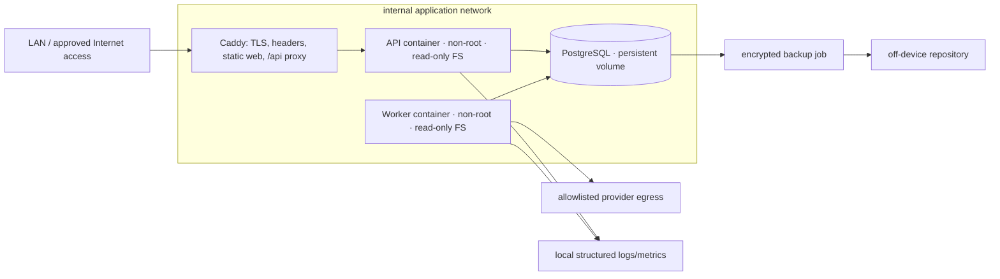

# Deployment design for Pi and future SaaS

## Pi deployment topology

Only Caddy publishes ports. PostgreSQL has no host/public port. API does not require general provider egress; worker egress is limited as the platform permits. Web assets are part of the Caddy image or a read-only volume produced by the build.

## Images and supply chain

- One multi-stage build from the workspace lock using a pinned package-manager version and `--frozen-lockfile`/equivalent.
- Separate final targets for web/Caddy, API, worker, and migration; share compiled packages/layers.
- Pin runtime base-image digests through an explicit update process; produce ARM64 images (and optionally multi-arch for development).
- No compilers, package managers, source tree, tests, or unused provider SDKs in final images.
- Non-root user, read-only root filesystem, dropped capabilities, `no-new-privileges`, writable tmpfs only where required.
- Generate SBOM/provenance and scan only after owner-approved dependency metadata disclosure policy.
- Tag releases immutably with commit and content digest; retain prior known-good images for rollback.

## Services

| Service | Responsibility | Persistent writes | Health |
|---|---|---|---|
| `web` | Caddy TLS/static assets/security headers/reverse proxy | Certificates/config state only as designed | HTTPS static + proxy readiness |
| `api` | Auth, validated reads/commands, enqueue, explanations | PostgreSQL through scoped role | Liveness; readiness checks DB/migration compatibility |
| `worker` | Jobs, providers, ingestion/projections | PostgreSQL and optional raw archive through scoped role | Liveness; readiness; heartbeat/lease metrics |
| `postgres` | Durable database | Dedicated volume | `pg_isready` plus monitored storage/backup state |
| `migrate` | One-shot controlled forward migration | Schema only under migration role | Exit code and migration ledger |
| `backup` | Scheduled encrypted dump/WAL/archive workflow | Local staging tmpfs/explicit volume, off-device target | Run metadata/checksum/age alert |

The migration container is not a dependency that automatically alters schema on normal startup. Deployment explicitly runs and verifies it before replacing API/worker.

## Configuration and secrets

- Commit a non-secret schema/example only. Validate all environment-specific values before service readiness.
- No production defaults for DB passwords, session/CSRF/encryption keys, provider credentials, hosts, or origins.
- Prefer mounted runtime secret files or the host's secret mechanism over broad environment exposure where feasible.
- Master encryption and backup keys are kept outside PostgreSQL and outside the same backup destination; document recovery custody.
- Provider account credentials are encrypted application data; global infrastructure secrets remain deployment secrets.
- Produce a redacted configuration fingerprint (names/versions/hashes, never values) for each release.

## Database and migrations

- PostgreSQL remains on an internal network and dedicated persistent volume with explicit size monitoring.
- Application roles: API, worker, migration, backup/read-only inventory; least privilege and no shared superuser.
- API/worker roles have forced RLS, no schema ownership, no `BYPASSRLS`, and no legacy write permission.
- Migrations are forward-only in production. Reversal is a new forward migration or full restore when data transformation is unsafe.
- Create large indexes concurrently where supported and outside transaction as a reviewed migration step.
- Before every production migration: current verified backup, disk headroom, production-like migration test, lock/duration estimate, and rollback trigger.

## Resource policy for Raspberry Pi

Exact limits require measuring the target Pi; proposed safe defaults are policy, not hardcoded facts:

- Worker concurrency starts at one provider job; provider pages/price batches have bounded memory.
- API has a small fixed database pool; worker has a separate smaller pool; migration/backup do not overlap heavy sync by default.
- Memory/CPU/PID limits and restart policy are explicit for every service.
- PostgreSQL and worker get graceful-stop windows so leases/checkpoints settle.
- Raw observation/archive and log growth have capacity alerts and retention jobs.
- Scheduled backups and heavy reconciliation avoid peak/manual refresh windows.
- No headless browser dependency in API/worker images unless a later approved adapter proves it necessary.

## Health, readiness, and alerts

### API

- `/health/live`: process/event-loop alive; no dependency fan-out.
- `/health/ready`: compatible migration version, database query, configuration valid; no provider calls.

### Worker

- Process liveness, recent heartbeat, DB connectivity, compatible migrations, lease ability.
- Provider health is reported in Data Health/metrics, not used to make the worker globally unready.

### Alerts

- Backup failure/age, restore-test age, disk/memory pressure, container restart loop.
- Queue oldest age/depth, expired leases, repeated run failures/partials.
- Stale wallets/providers, material reconciliation differences, unpriced/unknown growth.
- Provider credits/budget, 429/error rate, auth failure spikes.
- Migration incompatibility and API error/latency thresholds.

Owner chooses notification channel later; no external alert destination is configured without authorization.

## Backup and restore design

### Backup

- Encrypted off-device backups, not only the local Docker volume.
- At minimum, scheduled logical dump including roles/schema/data needed for restore; evaluate physical/WAL recovery when RPO requires it.
- Encrypt before leaving the Pi; checksum before/after transfer; immutable/append retention where destination supports it.
- Record start/end/status/tool/schema version/size/checksum/artifact ID/retention in operational metadata, never key material.
- Retain pre-migration and pre-cutover backups until the defined legacy retention period expires.

### Restore test

1. Provision an isolated PostgreSQL instance with no provider/network credentials.
2. Fetch/decrypt a selected backup using separate key custody.
3. Verify checksum, restore roles/schema/data, and apply no unreviewed migration.
4. Run row-count/constraint/content-hash/account-isolation checks and read-model smoke queries.
5. Record duration, result, discrepancies, artifact ID, and operator.
6. Destroy isolated restored data according to approved policy.

Set RPO/RTO only after owner decision and measured dump/restore time; do not invent guarantees.

## Deployment sequence

1. Build/test/sign/tag images in CI or an approved build host; do not compile/install on Pi startup.
2. Pull immutable image digests and redacted release manifest.
3. Confirm current backup and restore-test status, disk/resources, and migration plan.
4. Pause worker job claims; let active job checkpoint/cancel safely.
5. Run one-shot migration and verify migration ledger/schema checks.
6. Start/replace API and worker; readiness must pass before proxy traffic/claims.
7. Replace web/Caddy and smoke same-origin auth/read flows.
8. Resume workers gradually; monitor reconciliation, queue, resources, provider credits.
9. Record deployment/audit evidence. No automatic legacy deletion.

## Rollback

- Web/API regression: route Caddy back to previous immutable images compatible with the current schema.
- Worker regression: stop new worker, expire/release leases, run previous compatible worker; immutable observations remain.
- Additive migration regression: prefer forward fix. If schema/data is unsafe, stop writers and restore the verified pre-migration backup into a replacement volume/database; do not run an untested down migration.
- Cutover regression: route traffic back to legacy services/read path; v2 observations remain isolated and can resume later.
- Document compatibility window per release so old binaries are never pointed at an incompatible schema.

## Future SaaS evolution

Keep the same application/domain boundaries:

- Managed PostgreSQL with point-in-time recovery, connection pooling, private networking, encryption/KMS, replicas as needed.
- Horizontally scaled API and workers; queue leases/concurrency remain account/provider bounded.
- Object storage for encrypted raw archives and exports.
- Per-account quotas, billing/provider budgets, plan-aware schedules, and abuse protection.
- Central observability/on-call alerts with privacy/redaction controls.
- CDN/WAF at the same-origin edge; session store remains authoritative/revocable.
- Regional/data-residency and deletion/retention policy before public onboarding.

Do not split domain modules into microservices until measured independent scaling, ownership, or isolation needs justify the operational cost.

## Deployment acceptance criteria

- ARM64 images build from the lock, run as non-root/read-only, and contain no package install startup step or source bind mount.
- Web is static behind same-origin TLS; API and worker are separate processes; DB is internal only.
- API/worker health, limits, graceful shutdown, and migration compatibility are tested.
- Production config refuses defaults/missing secrets and redaction tests pass.
- Encrypted off-device backup and isolated restore complete within owner-approved RPO/RTO.
- Previous compatible images and legacy route can be restored without deleting v2 data.
